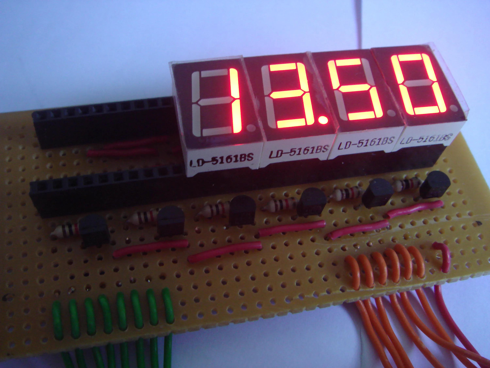
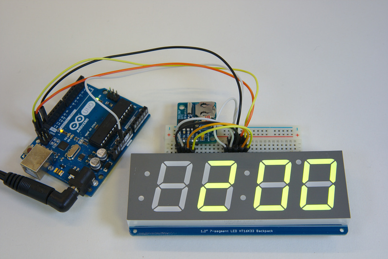
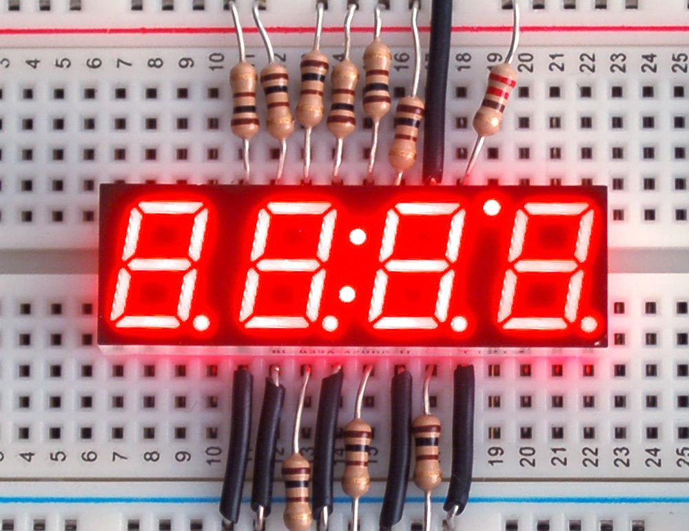

# Требования по направлению `Искусственный интеллект`

## Цель
Выполнить базовое задание и одно из двух заданий по выбору: либо по машинному зрению, либо по обработке текста (либо оба).
## Базовое задание
### Описание
Каждый раз, когда люди готовятся к отпуску, они исследуют варианты отелей для бронирования, а владельцы отелей стремятся предложить лучшие условия на рынке, делая свои гостиницы более привлекательными для клиентов и прибыльными для себя.

Отмена бронирования номеров представляет собой потенциальную проблему для индустрии туризма, поскольку она влияет на рейтинг отелей и их финансовый доход.

Применение алгоритмов машинного обучения может существенно повысить эффективность работы отелей, предварительно выявляя клиентов, склонных к отмене бронирования, и разрабатывая стратегии взаимодействия с такими клиентами.

Вам предоставляется задача создать алгоритм машинного обучения, который позволит определять, отменит ли клиент своё бронирование или нет.

### Реализация
Использовать методы машинного обучения для получения результата. Ограничений по использованию библиотек нет.

### Формат результата

Результат должен включать в себя код решения задачи и файл с ответами.
Файл с ответами содержит две колонки: `index` и `is_canceled` и должен быть в формате csv. Удалять строчки из тестового файла **нельзя**. Ответы должны быть получены по файлу test.csv.

Формат файла с ответами:

```
index,is_canceled
0,1
0,0
```

### Критерии
* accuracy

    Будет оцениваться метрика accuracy, её значение должно быть не ниже, чем 0.8, но чем выше, тем лучше.
* Работа с данными

    Отдельно будет оцениваться работа с данными: анализ, предобработка и т.д.
* Качество кода 

    Читаемость кода, эффективность, логичность.

### Данные
[train.csv](datasets/train.csv)
[test.csv](datasets/test.csv)
## Задание на машинное зрение
### Описание
Есть семисегментный индикатор.

Требуется по фотографии определить, какое время демонстрирует семисегментный индикатор. 
### Реализация
На вход системы должна поступать фотография, на выходе система должна выдавать время, которое было распознано на фотографии. Если на индикаторе отображены числа, которые не формируют время, то система должна выдавать сообщение: "Not a time".
Примеры:
Вход: 
\
Выход:
 "02:00" \
Вход: \

\
Выход:
"Not a time"

**Важно!** Не требуется реализовывать красивый или сложный интерфейс для взаимодействия с системой, однако какой-то **минимальный** интерфейс взаимодействия должен быть, чтобы пользователь мог запустить приложение и самостоятельно выбрать изображение, которое будет загружаться в систему, после чего получить результат на экране. *Допускается использование консольного интерфейса с указанием пути до изображения/директории с изображениями.* 
**Обязательно** отдельно реализовать возможность загружать одновременно несколько фотографий, и чтобы система записывала результат по каждому изображению в txt файл в следующем виде:
```
названиефото.jpg 
Not a time
фото.png
12:54
```
Можно реализовать одним из следующих способов: либо указывать путь до директории с изображениями, либо загружать архив с фотографиями.
### Формат результата
Необходимо представить:
* Исходный код для самой системы, чтобы можно было оценить код;
* Код обучения модели/моделей;
* Веса модели/моделей;
* Данные для обучения.
Запуск системы не должен быть сложным. Необходимо предоставить пошаговую инструкцию для запуска, например, "установить зависимости Python из файла requirements.txt и запустить файл main.py".
### Технологии
Лимита на технологии **не предусмотрено**.
### Критерии
* Точность работы системы

    Будет оцениваться точность работы системы: загружаться датасет с фотографиями и сравниваться полученное время с исходным. Итоговая точность будет считаться по следующей формуле:
    Количество правильно распознанных фотографий / общее количество фотографий
* Качество кода 

    Читаемость кода, эффективность, логичность.
* Архитектура системы

    Оценка всей архитектуры работы системы 
* Подготовка данных 

    Сбор, разметка, анализ, чистка, предобработка данных

## Задание на обработку текста
### Описание
К вам пришёл друг-владелец IT-компании. Ему нужно набрать несколько человек на должности, но он хочет набрать людей по "холодным" резюме. Для этого он решил разработать систему с использованием искусственного интеллекта для определения, подходит ли человек по одной из его вакансий, или не подходит ни к чему. Вам требуется разработать такую систему.
### Реализация
Дано резюме кандидата и список вакансий с их описанием. Необходимо определить, к какой вакансии подходит кандидат или он не подходит вовсе. 
На вход системы должен поступать текст резюме кандидата, на выход должно идти наименование вакансии, к которой подходит кандидат. Если он не подходит ни к одной вакансии, должно выводиться "None".
[Список вакансий](datasets/vakansii.txt). \
Пример в [файле](datasets/primery_rezyume.txt).

**Важно!** Не требуется реализовывать красивый или сложный интерфейс для взаимодействия с системой, однако какой-то **минимальный** интерфейс взаимодействия должен быть, чтобы пользователь мог запустить приложение, вставить текст резюме, и по этому резюме система выдала вакансию, на которую человек может претендовать.  *Допускается использование консольного интерфейса с указанием пути до файла/директории с файлами.* 
**Обязательно** отдельно реализовать возможность указать директорию с txt файлами с резюме, чтобы чтобы система записывала результат по каждому файлу в txt файл в следующем виде:
```
названиефайла.txt 
None
резюме1.txt
Backend разработчик
```

### Формат результата
Необходимо представить:
* Исходный код для самой системы, чтобы можно было оценить код;
* Код обучения модели/моделей;
* Веса модели/моделей;
* Данные для обучения.
Запуск системы не должен быть сложным. Необходимо предоставить пошаговую инструкцию для запуска, например, "установить зависимости Python из файла requirements.txt и запустить файл main.py".
### Технологии
Запрещено использовать большие языковые модели для решения задачи с помощью zero-shot и few-shot классификации. То есть нельзя использовать API от ChatGPT, GigaChat, модели семейства LLaMA и др. Можно использовать: модели семейства BERT, но ими не ограничено, главное ограничение указано выше.
### Критерии
* Точность работы системы

	Точность будет оцениваться по f1 score. 
* Качество кода 

    Читаемость кода, эффективность, логичность.
* Архитектура системы

    Оценка всей архитектуры работы системы 
* Подготовка данных 

    Сбор, разметка, анализ, чистка, предобработка данных
