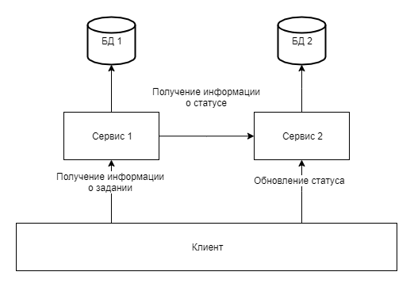

# Требования для backend

В качетстве вхожного испытания ставится задача написать сервер, который будет отвечать на зпросы по протоколу HTTP. Передача данных должна осуществляться при помощи протокола JSON.

## Обшие критерии

* Читаемость кода

Ваш проект должен быть доступен для понимания другими людьми. К этому относиится именование файлов, переменных, модулей, соответствие соглашениям языка и/или платформы, на которой вы разрабатываете.

* Инструкция по запуску

Вместе с вашим проектом необходима инструкция, котора позволит развернуть ваше решение на рабочем компьютере другого разработчика. Необходимо указать, какое ПО необходимо для работы с проектом, какие действия необходимо сделать для запуска/сборки проекта, будь то команды в консоли или иные настройки в интерфейсе сред разработки.

* Git

Система управления версиями GIT дефакто сегодня заняла лидирующие позиции, и если вы умеете с ней работать - это большой плюс. При работе в лаборатории все равно будет необходимо научиться с ней работать, но лучше уже иметь опыт работы.

* Кроссплатформенность

Крайне желаельна возможность запускать ваше решение на разных операционных системах. Это не критично, но желательно. 

## Требования для разрабатываемых сервисов

Предпологается три разных уровня в зависимости от сложности реализуюемого сервиса. Чем более сложную задачу вы решите - тем больше шансов на попадание в лабораторию.

Все задания идет на примере сервиса To-Do. Идея максимально проста для понимания, но на самом деле качественный сервис сделать не так и просто.

### Первый уровень

Необходим сервис, который будет обеспечивать несколко операций:
* Создание элемента/задания в **своем** списке заданий
* Пометка задания как выполненное/невыполненное
* Архивирование заданий
* Выборка списка заданий (все/за период/только выполненные/только не выполненные)
* Получение информации о одном задании

Сервис может как содержать систему аутентификации, так и работать без нее.
Для упрощения модели можно передавать идентификатор пользователя как параметр ко всем запросам.

В задании необходимо хранить:
* Название задания, строка
* Описание задания, строка
* Дата создания задания, дата
* Флаг выполненности задания, логический тип

#### Критерии оценивания

* **Грамотность составления путей к API**, именно самих URL. Как именно передаются различные параметры, насколько url согласованы между собой, удобно ли ими пользоваться при работе с API.
* **Хранилище данных**, как именно хранятся данные в вашей системе, в опретивной памяти, файле, базе данных.Каждый из вариантов должен быть аргументирован. Что произойдет, если ваше приложение вдруг остановится?
* **Устойчивость**, есть ли запросы, на которых ваше приложение вернет 500, или запросы после которых приложение выйдет из строя? Разумеется количество таких ситуаций должно стремиться к нулю.
* **Скорость работы**, насколько долго отвечает ваш сервис на тот или иной запро? Сколько запросов в секунду он может обработать? Чем быстрее он работает - тем лучше.
* **Конфиденциальность**, как именно сервис узнает, какой именно пользоватеть выполняет запрос, и с чьими задачи необходимо работать?

### Второй уровень

На втором уровне необходима полноценна база данных. Для SQL мира - как минимум SQLite, для NoSQL мира - любая.

На втором уровне должна быть обеспечена возможность горизонтального масштабирования.А именно, должна быть возможность запустить одновременно сколь угодно много экземпляров сервера, и обращаться к любому из них, при этом получая одинаковый результат. Таким образом необходимо добиться взаимозаменяемости экземпляров сервиса.

Имя задачи теперь обязано быть уникальным в рамках одного дня. То есть не должно быть возможности создать две задачи за одни сутки с одинаковым названием. При наличии несколькоих пользователей это правило должно работать для каждого пользователя отдельно. Для тестирования можно сделать промежуток не сутки, а минута, например. Это не должно иметь большой разницы.

Факт выполнения задания должен теперь сохраняться не как логическое значение. Необходимо хранить историю, когда пользователь перевел данное задание в положение "выполненно" или "невыполненно". Соответственно при формировании представления задания необходимо основываться на последнем изменении.

### Третий уровень

Необходимо реализовать второй, вспомогательный сервис. В нем будет храниться иформация о фактах перевода того или иного задания в положение "выполнено" и "невыполнено".

Запросы на изменение состояния теперь должны отправляться только во второй сервис. Желательно, чтобы второй сервис имел свою базу данных.

Первый же сервис теперь запрашивает информацию о текущем статусе задания у второго сервиса. Примерная модель взаимодействия представлена на рисунке ниже.

Желательно обеспечить работоспособность обоих сервисов, при выходе из строя любого из них. Так, необходимо предусмотреть ситуацию, в которой недоступен сервис 2, и выбрать оптимальное поведение для сервиса 1.

Также желательна возможность горизонтального масштабирования каждого из сервисов, чтобы клиент мог обращаться к любому из сервисов и не бояться, что данные куда-то как-то пропадут.