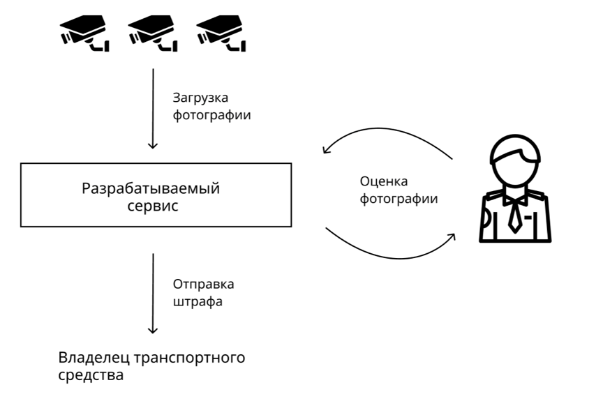
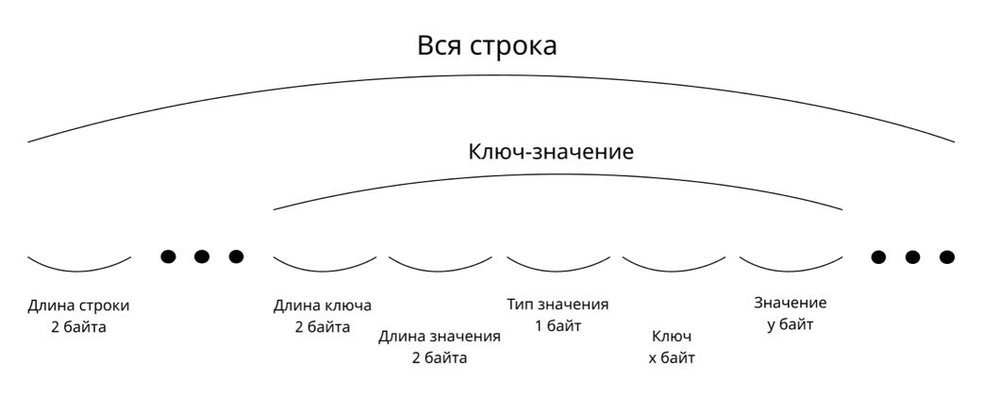
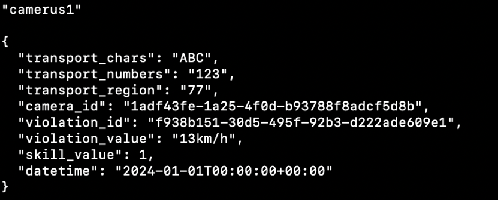
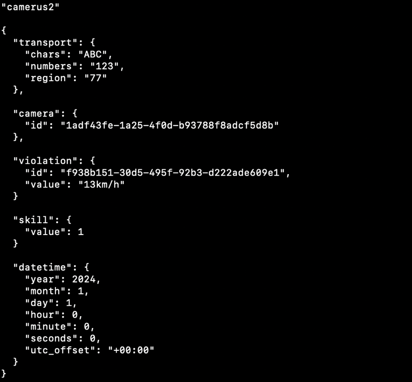
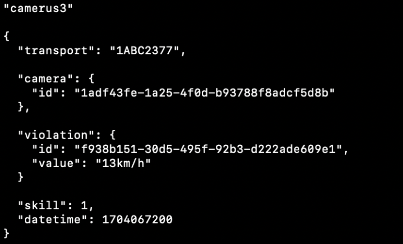

# Требования по направлению `Backend`

## Описание
Вы начальник ГИБДД Гиперборейского городского округа. Только что завершилась очередная русо-ящерская война. В этой войне, к сожалению, русы потеряли ценнейшие технологии машинного обучение, которые в 21 веке стали называться якобы технологиями будущего. Для обеспечения безопасности на дорогах вами было принято решение о создании системы автоматической фиксации нарушений правил дорожного движения, однако работу нейронных сетей будут выполнять пленные ящеры - **проверяющие специалисты** или **оценщики.**
## Требования
### Принцип работы
Основной процесс работы заключается в следующем:

1. В разрабатываемый сервис автоматически загружаются фотографии с камер, расположенных на проезжей части.
  
1. **Проверяющие специалисты** оценивают фотографии возможного правонарушения (в дальнейшем именуется **случаем**).
  
1. Если на фотографии было зафиксировано правонарушение, то владельцу отправляется уведомление о штрафе.
  

### Загрузка фотографии
Фотография загружается камерой путем обращения к API, предоставляемым вашим сервисом. Помимо фотографии загружаются данные, относящиеся к **случаю**. 

Среди данных:

1. Государственный номер транспортного средства.
  
1. Обстоятельства **случая**: идентификатор камеры, идентификатор правонарушения, значение правонарушения (для правонарушения “превышения скорости” - значение скорости, а для “выезд за стоп-линию” - булево значение. И то, и то передается в виде строки. “50 км/ч” или “Да”).
  
1. Необходимый **уровень компетенций** **проверяющего специалиста** в виде натурального числа.
  
1. Дата и время.

Эти данные отправляются в виде одной байтовой строки, которую необходимо преобразовать в удобный для хранения формат. Формат строки указан ниже:
  

  
Другими словами, в начале байт-строки идет значение ее длины, а затем некоторое число пар “ключ-значение”. Каждая пара состоит из 5 частей: длина ключа, длина значения, тип значения, ключ и само значение. Длина ключа и длина значения представляют беззнаковое целоечисленное значение.

Ключ - строка в кодировке UTF-8.

Типом значения могут быть:

1. “00000000” - Строка в кодировке UTF-8.
  
1. “00000001” - Целое число в формате LEB128.
  
1. “00000010” - Словарь. Структура данных типа “ключ-значение”. После окончания значения первой пары “ключ-значение”, сразу идет ключ второй пары без каких-либо метаданных перед ним.

Важно заметить, что вся байт-строка является словарем с одним дополнением: в начале строки записано значение длины всей строки.

Камеры разделены на виды. Каждый вид имеет свою собственную спецификацию полей. Виды камер указываются до старта работы сервиса  (алгоритм обработки байт-строки устанавливается программно в виде кода) и хранятся в базе данных. Ниже приведены виды камер и их спецификации, обработка которых обязательна в разрабатываемом сервисе. Учтите, что количество видов камер и спецификаций в теории может как увеличиваться, так и уменьшаться.
  

  

  

  
Каждая камера перед отправкой **случаев** должна быть зарегистрирована. При регистрации камеры, указывается ее тип, координаты и краткое описание, после регистрации возвращается идентификатор.

При загрузке **случая**, следует проверять валидность данных, а также идентификаторов камер и правонарушений.

Для вашего удобства, создан сервис, который предоставляет возможность сериализации и десериализации данных. Он доступен по “host:port”, документация - “/docs”.
### Контактные данные
Для отправки уведомления о правонарушении требуются контактные данные владельца транспортного средства. Ими могут быть: email, telegram, vk, номер телефона и т.д. Для этого необходимо предусмотреть возможность импорта этих данных из excel-файла, в котором хранятся государственный номер и сами контактные данные.
### Правонарушения
Разрабатываемому сервису необходимо понимать, какие существуют правонарушения. Аналогичным образом как для контактных данных необходим импорт списка возможных правонарушений из excel-файла. В файле хранятся два столбца: тип правонарушения и размер штрафа.
### Обработка фотографии
Алгоритм обработки заключается в следующем:

1. У каждого **проверяющего специалиста** есть **уровень компетенций**, обозначаемый некоторым натуральным числом **x**.
  
1. **Случай** считается оцененным, если достигнут консенсус **k проверяющих специалистов** с **уровнем компетенций** **x** - все проверяющие либо согласны с выписыванием штрафа, либо не согласны.
  
1. Если консенсус не достигнут, то для оценки **случая** необходим консенсус других **k** **проверяющих специалистов** с уровнем компетенций равным **x + 1**.
  
1. Процесс продолжается до достижения соглашения.

Допускается, что в системе достаточно **проверяющих специалистов** с одинаковым **уровнем компетенций**. То есть не надо обрабатывать ситуацию, когда, например, **случай** должны обработать 5 проверяющих с рейтингом **x**, а в системе их зарегистрировано всего 4.

Распределение **случаев** происходит следующим образом:

1. Есть общий пул **случаев**. **Проверяющий специалист** получает любой подходящий под его **уровень компетенций случай** из пула и оценивает его (если у **случая** необходимый **уровень компетенций** равен **z**, то и у **проверяющего специалиста** **уровень компетенций** должен быть равен **z**)
  
1. Если **специалист** не оказался последним необходимым **оценщиком**, то **случай** остается в пуле.
  
1. Если **специалист** оказался последним необходимым **оценщиком**, то при общем соглашении **случай** считается оцененным, иначе он возвращается в пул, однако требуется оценка уже более компетентных **специалистов**.
### Рейтинг
После каждого обработанного **случая** возникает необходимость оценить работу **проверяющего специалиста**. Для этого вводится рейтинговая система и понятия **отчетного периода**. **Отчетный период** - время, по итогам которого подводятся итоги работы **специалистов**. Вот положение этой системы:

1. Рейтинг **специалиста** оценивается в процентах правильно решенных **случаев**. Учитываются **случаи** как с последующим штрафом, так и без него.
  
1. Рейтинг начисляется всем **специалистам**, оценившим **случай**. То есть, если соглашение по **случаю** принято на **x + 2** уровне компетенций, то рейтинг начисляется **специалистам** с **уровнем компетенций** равным **x + 2**, **x + 1** и **x**.
  
1. После окончания **отчетного периода** у 10% процентов **специалистов** с наивысшим рейтингом **уровень компетенций** увеличивается на единицу, а у 10% процентов с наихудшим рейтингом - уменьшается на единицу. Если **проверяющий специалист** имеет минимально допустимый **уровень компетенций**, равный единице, то он остается без изменений. Остальные 80% **специалистов** также остаются без изменений.
  
1. Стоит учесть, что по итогам **отчетного периода**, **уровень компетенций** остается неизменным у **специалистов**, решивших менее **j** **случаев**. То есть в 100% **специалистов**, которые учитываются при изменении рейтинга, **оценщики**, решившие менее **j** **случаев**, не учитываются. 

Текущее состояние рейтинговой таблицы доступно пользователем в любой момент времени.
### Обучение
Необходимо предусмотреть возможность обучения **проверяющих специалистов** - в разрабатываемом сервисе должна быть конечная точка, возвращающая решенные **случаи** вместе с результатом и минимально необходимым **уровнем компетенций,** предоставляемым камерой, для решения **случая**. **Специалист** с любым **уровнем компетенций** может просматривать случаи с любым необходимым **уровнем компетенций**. Необходимо предусмотреть пагинацию, а также фильтрацию по камере, необходимому **уровню компетенций**, по типу камеры, по типу нарушения и по промежутку дат, в который произошло или не произошло правонарушение.
### Отправка штрафа
Отправка уведомления о штрафе происходит сразу после достижения соглашения о выписывании штрафа. Вместе с фотографией правонарушения отправляются координаты места происшествия, тип правонарушения, значение правонарушения, размер штрафа, дата и время. Штраф отправляется по одному или нескольким контактам, хранящимся в базе данных, для данного государственного номера. Желательно реализовать несколько способов отправки уведомления о штрафе.
### Пользователи
В системе существует два вида пользователей: **руководители** и **проверяющие специалисты**.

**Руководители** регистрируются программно, а для регистрации **проверяющих специалистов** необходимо реализовать API. Аутентификацию необходимо проводить с помощью Access и Refresh токенов в формате JWT.

У каждого **проверяющего специалиста** должна быть фотография профиля.

После регистрации **проверяющего специалиста**, его учетная запись должна быть подтверждена **руководителем**. До этого момента **специалист** не может ничего делать.

Для **руководителей** доступно текущее состояние каждого **случая**: текущие оценки и их количество. Для **проверяющих специалистов** это недоступно, за счет этого достигается независимость и объективность оценки каждого **случая**. 

**Руководители** также могут просматривать небольшую аналитику о работе подчиненных: для определенного промежутка времени по каждому из **проверяющих специалистов** необходимо предоставить количество всего решенных **случаев** для каждого дня в промежутке, количество правильно решенных, количество неизвестных **случаев** (по которым еще не принято решение), а также максимальное количество подряд решенных задач.
### Настройки приложения
В настройках приложения конфигурируются определенные выше константы **k** и **j,** а также размер **отчетного периода**. Предполагается, что эти константы устанавливаются перед началом работы сервиса и что они постоянны на протяжении всего времени работы. 
### Дополнительно
Вышеописанное - обязательная часть. В качестве дополнительного задания возможно выполнение следующих заданий:

1. Сервис зарплат.  
В отдельной базе данных хранятся текущие деньгами, заработанные **специалистами**. Заработанные деньги рассчитываются следующим образом: +10 у.е. и -5 у.е. за правильную и неправильную оценку соответственно, при этом в минус уйти невозможно.  
**Специалисты** могут запросить вывод средств. В этом случае фиксируется момент выплаты средств, счет уменьшается на заданную величину и сервис обращается по конечной точке, определенной в конфигурации приложения. 

2. Rate limiter для конечной точки с загрузкой фотографии от камеры. Допускается, что в случае ответа 429, камеры будут сохранять внутри себя неотправленные фотографии и пытаться отправить их снова через некоторое время.
  
3. Дополнительный анализ для руководства.  Возможно проведение анализа данных по датам, дням недели и другим параметрам.
  

4. Индивидуальное расширение функционала.  Приветствуется творческий подход к добавлению новых возможностей.

Выполнение этих пунктов повысит ваши шансы на успешное выполнение тестового задания.
## Критерии

1. Целостность созданного сервиса  Backend создается не просто так, им будут пользоваться конкретные клиенты, будь то сайты, мобильные приложения, кассовые автоматы или что угодно еще. При разработке и продумывании API важно обратить внимание на процессы, автоматизацию которых обеспечивает сервис.
  
2. Архитектурная составляющая  
В современных фреймворках приняты устоявшиеся подходы и практики, например использование MVC. Обоснование "сделано при помощи архитектуры N потому что я её знаю/захотелось попробовать" будет более чем достаточно, при этом если некоторая архитектура выбрана - важно её придерживаться.
  
3. Документация 
Описание того, как можно взаимодействовать с сервисом (Wiki, OpenAPI, Swagger...).
  
4. Грамотное использование ресурсов 
Стоит обратить внимание на то, как Вы используете вычислительные мощности. Например, отправлять 5 SQL запросов вместо одного сложного выгодно не всегда. Нет цели выдать 100500 запросов в наносекунду на Raspberry Pi. Помните, что "Преждевременная оптимизация – корень всех зол".

## Технологии
Лимита на технологии не предусмотрено, при решении задания можно использовать любой стек.

## Окружение
Будет полезно обратить внимание на следующее:

1. Тесты (Unit, e2e, integration...) 
Backend сервисы как правило используются перечнем клиентов, и тесты, подтверждающие функциональность системы, приносят пользу.
  
2. Docker 
Возможность запуска приложения в Docker позволяет оперативно встроить разработанное решение в существующие процессы.
  
3. База данных 
В рамках тестового задания необходимо использовать "боевую" базу данных, хранение данных в памяти недопустимо.
  
4. Конфигурация 
Возможность конфигурации приложения позволяет не переписывать участки кода вручную при изменении требований.
