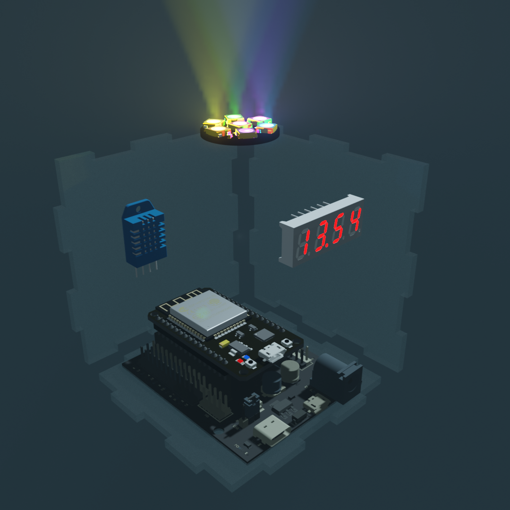

# Требования по направлению `Internet of Things`

## Цель

Необходимо создать устройство, которое может стать полезным атрибутом на любом рабочем столе.
## Описание

У вас есть друг, у которого есть всё. Через месяц у него день рождения и перед вами встала задача придумать нужный и необычный подарок, который сможет его порадовать. Друг - техногик и вы решаете подарить ему самодельное устройство. Но насколько проработанное устройство вы успеете собрать за этот месяц?
#### Уровень 1
Устройство состоит из адресные светодиодов, датчика температуры и четырёхразрядного семисегментного индикатора. Устройство должно иметь возможность отображения времени, начальное значение которого может быть задано из кода, и температуры в помещении. Светодиодный модуль должен отображать различные события с помощью анимации. К примеру, понижение комфортной температуры или влажности.
#### Уровень 2
То же устройство, но добавляется взаимодействие с сетью. Устройство должно иметь возможность отображения времени, начальное значение которого бралось бы с API, погоды на улице и температуры в здании. Светодиодный модуль должен отображать различные события с помощью анимации.
#### Уровень 3
К разработанному устройству добавляется возможность управления светодиодным модулем и отслеживания температуры через удалённый интерфейс (Сайт, мобильное приложение, IoT-платформа)

## Требования к решению задания

1. Git-репозиторий с кодом проекта и описанием в `README.md`
2. Схемы сборки устройста в графическом отображении
3. Видео демонстрации работы устройства и рассказ о проекте

## Критерии

* **Уровень устройства и его работоспособность** - Задание какого уровня было реализовано, как устройство функционирует в различных ситуациях.
  
* **Потери** - При разработке проекта не сожжён ни один модуль или микроконтроллер.
  
* **Качество и продуманность кода** - Обращается внимания на то, как реализовываются взаимодействия с модулями, обрабатываются запросы к API, создаются анимации для светодиодов.

* **Глубина проработки отдельных компонентов системы** - То, как выглядит отображение информации на дисплее, анимации на светодиодном модуле, интерфейс управления
## Материалы и оборудование

Для выполнения данного задания вам потребуется специфичное оборудование. От микроконтроллеров до светодиодных модулей. Всё необходимое для выполнения задания вы сможете брать в Техноковоркинге. Для работы над проектом из дома можно использовать среды симуляции. К примеру, Tinkerkad.

[Информацио о техноковоркинге](https://www.mirea.ru/education/megalaboratories/tekhnokovorking/)

[Среда симуляции Tinkerkad](https://www.tinkercad.com)
