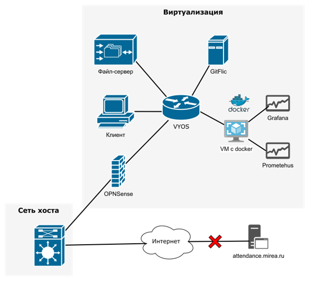

# Требования по направлению `ИТ-инфраструктура`

## Цель
Необходимо развернуть топологию небольшой инфраструктуры для домашнего использования.

## Описание
Разбирая по весне чердак на даче, вы нашли старый сервер, который лет десять назад туда убрал дед и забыл. И, о чудо, он работает (дед тоже, огород вот копает)! Кажется, в прошлой жизни эта железка была весьма крутой. Однако время идет, и ни на что иное, кроме как стать центром домашней лабы она не способна. С другой стороны, впереди еще все лето, и на даче с дедом и без сервера будет явно скучно. Надо сделать с ним что-нибудь этакое.

## Уровень 1
Нужно подготовить стенд для виртуализации. Если вдруг под рукой есть своя железка, на которую можно невозбранно поставить полноценную среду виртуализации Proxmox VE— это прекрасно. Но если нет, не расстраивайтесь, хватит и обычного VirtualBox (если компьютер слабый — можно обратиться в Техноковоркинг).

Внутри среды виртуализации необходимо создать виртуальную машину - клиент и запустить внутри нее ОС семейства Linux. Дистрибутив — любой, но дед больше любит Debian-подобные.

## Уровень 2
Давайте разберемся с сетью. Просто виртуальная машина это здорово, но хотелось бы иметь независимую сеть на сервере. Создайте еще одну ВМ, выступающую в качестве шлюза. Дед что то говорил про VYOS и OPNSense, но если кажется, что это все для слабаков, можно применить и что то покруче) Сделайте так, чтобы ВМ из первой части оказалась во внутренней изолированной сети от сети, к которой подключен сервер, и при этом имела доступ в интернет везде, кроме https://attendance.mirea.ru/.

**Примечание:** если сеть сделать не получилось, не расстраивайтесь и делайте следующие пункты, оставив статическую адресацию. На баллы по другим заданиям это не повлияет.

## Уровень 3
Добавим еще одну виртуальную машину и сделаем на ней файлопомойку. Настоящую файлопомойку. В этом нам поможет Nextcloud или TrueNAS. Доступ к ней должен быть как из внутренней, так и из внешней сети для сервера.

## Уровень 4 (дед забыл принять таблетки)
Надо же, нам все еще скучно! Ну хорошо, тогда задачка посложнее: нужно сделать виртуалку с gitflic! Теперь у нас есть свой git!

## Уровень 5
Веселье продолжается: создаем виртуалку с docker и разворачиваем на ней пару контейнеров с Prometheus и Grafana. Заводим в них все развернутую красоту и наблюдаем как все работает! Теперь мы точно не пропустим, что что-то упало!

## Требования к решению задания
1. Репозиторий с набором VM и описанием в README.md сетевой топологии и последовательности развертывания.
2. Сетевая топология.
3. Видео демонстрации решения с запуском соответствующих команд, демонстрирующих корректную работу инфраструктуры и ее функциональность.

## Критерии
- **Уровень развертывания инфраструктуры** - Задание каждого уровня дает +3 балла. Баллы начисляются по следующему алгоритму:
  - 1 балл — соискатель приступал к выполнению задания: создана ВМ и запущено необходимое ПО.
  - 2 балла — ПО сконфигурировано, так как написано в задании;
  - 3 балла — Сконфигурированы дополнительные опции (настроены dhcp, DNS, подключено управление пользователями).
- **Глубина проработки отдельных компонентов системы** — Отдельно оценивается использование ПО, не описанного в задании, но выполняющего ту же функцию (или улучшающее предложенную инфраструктуру) — максимум +1 экстра балл за каждый уровень.

## Эталонная топология

## Материалы и оборудование
Для выполнения данного задания вам потребуется специфичное оборудование и ПО. При необходимости, компьютер для выполнения задания вы сможете запросить в Техноковоркинге.