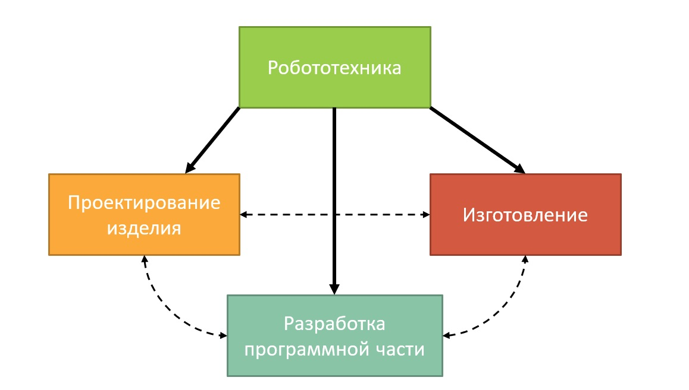
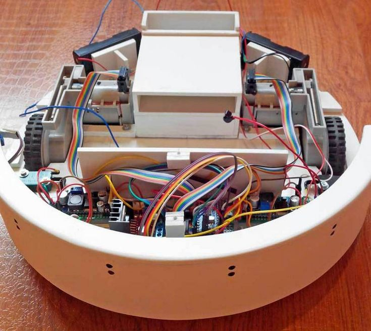
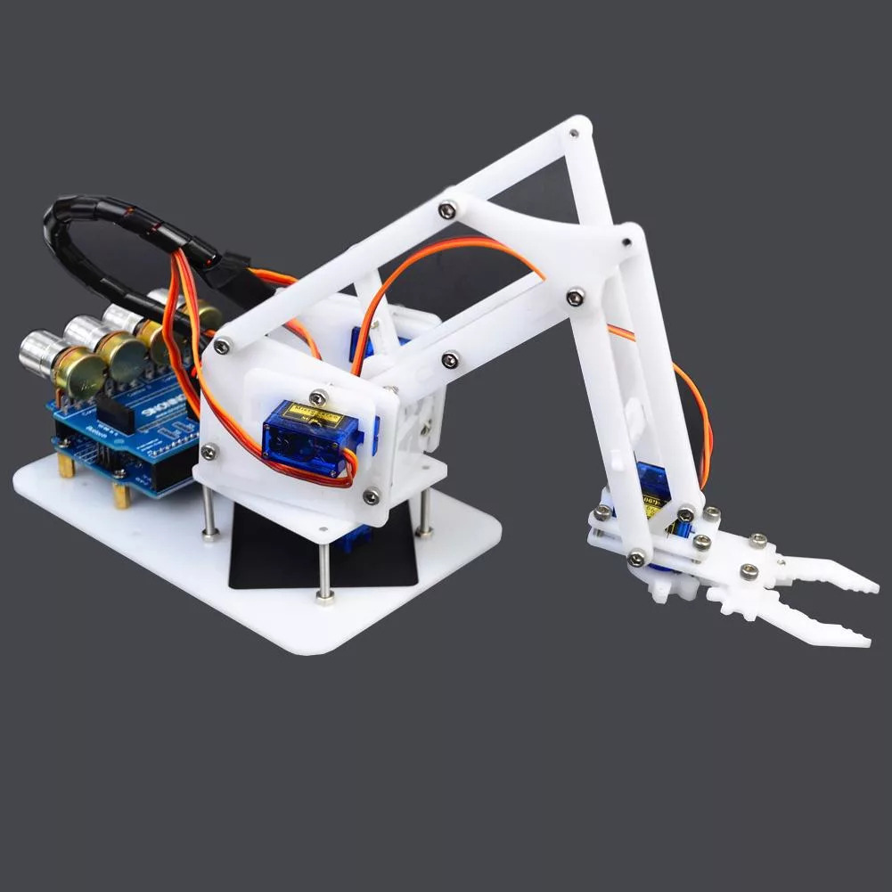
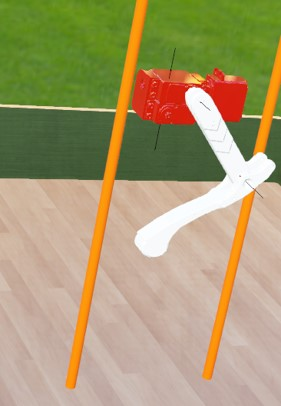
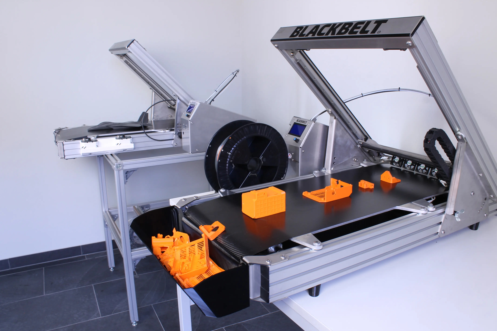

# Требования по направлению `Робототехника`

### Предисловие
По данному направлению и в этом году предлагается выбрать одно из трёх заданий:
- [Задание на проектирование](#задание-на-проектирование)
- [Задание на разработку программной части](#задание-на-разработку-программной-части)
- [Задание на автоматизацию изготовления](#задание-на-автоматизацию-изготовления)

Выбирая определённое задание, в дальнейшем, вы не ограничиваете себя определённой областью деятельности, 
поэтому смело можете браться за задание, в успешном выполнении которого вы больше уверены.
Задания сделаны с запасом сложности, поэтому не переживайте раньше времени, если задание не получилось выполнить на 100%.

Все задания учитывают основные области деятельности лаборатории в области робототехники

## Задание на проектирование

Проектирование - начальный этап разработки робототехнической системы, 
который следует преодолеть команде после получения задания или появлении идеи.
Именно на этом этапе закладываются дальнейшие функции робота.
Но чтобы не грузить вас написанием проектной документации предлагаем более практик ориентированное задание, направленное на выявление следующих компетенций:
- Умение работать в САПР программах, с целью создания чертежей отдельных деталей и сборок
- Знание базовых электрических узлов и их характеристик в мобильных роботах
- Умение подбирать оптимальные сторонние элементы робототехнической системы (сенсоры, движители)

### Цель
Спроектировать мобильного робота, ориентированного на исполнение прикладных задач. 
Разработка физического прототипа является **необязательной** частью.

### Описание
Предлагается решить типовые задачи или придумать идею для собственного робота. Общим для этих заданий является упор на возможность изготовления конструкций с помощью FMD-печати. У лаборатории есть проекты с металлическими изделиями, но этим занимаются специалисты в своей области, и требовать от вас такого же мы не можем.
Оцениваться задания также будут по-разному, учитывая особенности более творческого, но и фривольного второго варианта.

> В нашей лаборатории многие проекты спроектированы на TFlex САПР 17, но в ходе выполнения этого задания рекомендуется проектировать в любом отечественном САПР

#### Типовое задание 1 - робот-пылесос

Предложенным заданием является проектирование собственного прототипа робота-пылесоса, которого возможно напечатать на 3D-принтере.
Его конструкция не требует большого количества времени, но позволяет продемонстрировать нужные компетенции.

Что мы ждём от вас, как результат:
- Чертежи печатных элементов
- Сборка конструкции в САПР (всех печатных и покупных элементов)
- Принципиальную электрическую схему робота
- Небольшую презентацию по потенциальному функционалу

Ограничения:
- Использование отечественных САПР
- Конструкция должна быть ремонтнопригодной, а значит лучше отказаться от печатной резьбы и использовать гайки
- Подбор покупных компонентов (двигателей, контроллеров и прочего) следует выполнять с учётом их доступности популярных маркетплейсах

#### Типовое задание 2 - робот-манипулятор

Предполагает разработка манипулятора от 3 степеней свободы с возможностью установки различных хватов и насадок. Размеры ограничиваются лишь размерами типовых сервоприводов (хоть с обратной, так и без обратной связи).
Очень хорошим дополнением будет реализация симуляции подвижных элементов в САПР. Данный манипулятор в достаточно компактном образце может стать прекрасным модулем для наших робособак!

Как результат мы ждём от вас:
- Чертежи печатных элементов
- Сборка конструкции в САПР (всех печатных и сторонних элементов)
- Принципиальную электрическую схему робота
- Небольшую презентацию по потенциальному функционалу

Ограничения:
- Использование отечественных САПР
- Конструкция должна быть ремонтнопригодной, а значит лучше отказаться от печатной резьбы и использовать гайки
- Подбор сторонних компонентов (двигателей, контроллеров и прочего) следует выполнять с учётом их доступности в популярных маркетплейсах

#### Собственный робот
В данном подварианте задания мы предлагаем проявить немного фантазии и спроектировать
*мобильного* робота под прикладную задачу. Вариант подойдёт для людей, у которых есть давно идея, но руки не доходили. Робот также предполагается в исполнении из пластика на 3D-принтере, что следует учитывать.

Если ваша идея окажется достаточно интересной, то после прохождения отбора ты сможешь продолжить реализовывать идею в "металле", чем занимаются наши коллеги с алюминиевой робо-собакой.
Кроме вышеуказанных компетенций мы ожидаем от вас креативного подхода, что естественно будет давать бонусы при наборе.

Всё также мы ждём в форме результата:
- Чертежи печатных элементов
- Сборка конструкции в САПР (всех печатных и сторонних элементов)
- Принципиальную электрическую схему робота
- Небольшую презентацию по идеи робота в целом

Ограничения:
- Использование отечественных САПР
- Конструкция должна быть ремонтнопригодной, а значит лучше отказаться от печатной резьбы и использовать гайки
- Подбор сторонних компонентов (двигателей, контроллеров и прочего) следует выполнять с учётом их доступности в российских магазинах и маркетплейсах

### Критерии

* Оригинальность идеи

  Данный критерий в первую очередь направлен на людей, создающих своего робота,
  но сюда же будут идти баллы за уникальные решения в роботе-пылесосе.
  
* Читаемость и чистота чертежей

  Следует учитывать, что работают инженеры в командах, а значит следует уважать время ваших коллег.
  Чертежи и электрическая схема должны быть читаемыми может быть не для человека со стороны,
  но хотя бы для профильного специалиста.
  
* Унификация сторонних элементов

  Обилие различных крепежей, двигателей, сенсорики - усложняет сборку, покупку, поддержание вашего робота.
  Следует использовать актуальные и массовые элементы, доступность которых не под вопросом.
  Если где-то можно задействовать ранее использованный в сборке винт, гайку, шайбу - используйте!
  
* Реализуемость

  Данный критерий отражает то, насколько на уровне текущего развития технологий существует возможность создания физического прототипа.

* Расходование ресурсов

  Не следует особо заигрываться с обилием датчиков, дорогими двигателями или микрокомпьютерами. Всё должно быть в пределах DIY проекта.
  
### Формат публикации результатов
Потребуется прикрепить ссылку на облачное хранилище со сборкой, инструкцией в формате Markdown (чтобы знать какие файлы смотреть и чем открывать) и прочими материалами проекта.

## Задание на разработку программной части
Данное задание призвано найти студентов, способных работать с симуляцией робототехнической системы.
Этап виртуального моделирования уже спроектированного робота сложно переоценить в современной робототехнике так,
как позволяет отследить ошибки, допущенные при проектировании или при разработке программного кода, до испытаний на прототипе, что в итоге снижает риски.
Компетенции, которые мы ожидаем увидеть по данному заданию:
- Умение строить математическую модель узлов робототехнической системы
- Работать с симуляцией и программировать виртуальную среду
- Грамонтно создавать программные модули для отдельных узлов системы

### Цель
Смоделировать работу механического узла робота в симуляторе

### Описание
Вам предлагается взять спроектированную ногу робота квадрупеда и для неё разработать в виртуальной среде демонстрационный стенд и программный модуль.
Демонстрационным тестом должна являться площадка с вертикальными линейными направляющими, позволяющая ноге свободно поднимать вверх и вниз.
В задачи программного модуля должно входить: 
решение [задачи обратной кинематики](https://en.wikipedia.org/wiki/Inverse_kinematics) ноги, контролировать нагрузку в точках крепления, выполнять динамически сформулированные движения.
Для возможности динамического контроля нагрузки и положения разрешается использовать PID-регулируемые двигатели (с обратной связью),
а на конце ноги установить датчик давления.

Что мы ждём от вас, как результат:
- Решение задачи обратной кинематики для полученной модели ноги
- Проект виртуальной среды, где робонога выполняет прыжки с определённой нагрузкой в точках крепления
- Видео ролик с демонстрацией работы (на случай, если не получится запустить проект)

Ограничения:
- Язык программирования: C++ или Python
- Максимальный крутящий момент торможения двигателя до 70 кг*см
- Все 2 двигателя в робоноге имеют одинаковые характеристики для унификации

> Мы не ограничиваем вас в выборе среды симуляции, но рекомендуем использовать:
[Gazebo](http://gazebosim.org/), [Webots](https://cyberbotics.com/), [PyBullet](https://pybullet.org/).

### Критерии

* Решение задачи обратной кинематики

  Создать демонстрационный стенд и записать ролик можно было бы и без решения задачи обратной кинематики,
  но именно знание некоторых разделов математики и применение их на практике мы ожидаем от вас
  
* Работа с сенсорикой
  
  Программный модуль должен не только задавать нужное движение ноги, но и сообщать вышестоящим модулям о положении ноги, нагрузке и другую информацию.
  Чем лучше это будет организованно сразу, тем более комплексное представление будет иметь о себе робот
  
* Чистота кода программного модуля

  Простое и понятное условие к любому коду в современных реалиях коллективной разработки
  
* Экономия вычислительны ресурсов

  Симуляция не должна быть перегружена и в идеале должна рассчитываться в real-time на среднем железе,
  поэтому можете пойти на оптимизацию геометрии элементов ноги, если посчитаете нужным. Главное сохранить пропорции рычагов
  
### Формат публикации результатов
Требуется прикрепить ссылку на репозиторий GitHub с разработанной виртуальной средой и документацией. Видеоролик приложить в облако, а ссылку на него в документации в репозитории

### Материалы
Ссылка на архив с элементами ноги робота (в формате полигональной графики .obj): https://disk.yandex.ru/d/7YWnuxXpysc3Qg

## Задание на автоматизацию изготовления
Время - ресурс не просто ограниченный, но и невосполнимый. Именно поэтому мы так любим сервисы, которые предоставляют доступ к LLM моделям нейронных сетей, которые в свою очередь экономят иногда нам время. Почему бы тогда не заняться автоматизацией и других рутинных повседневных задач. В нашей лаборатории очень часто приходится изготавливать штучные изделия, что не позволяет использовать опции заказа крупных партий на специализированных производствах. Из-за этого наш лучший друг - это 3D-принтер, который несмотря на свою открытость к программированию, всё ещё остаётся достаточно неавтоматизированным станком. А как же иногда хочется, чтобы он делал всё за тебя... Он же практически как робот! Если вы думаете также, тогда предлагаю попробовать свои силы в этом задании. Оно понравится тем, кто уже хорошо освоился в программировании и хотя бы немного понимает, как работают FDM-принтеры.

Компетенции, которые затрагивает данное задание:
- Создание кодогенераторов на основе gcode
- Элементарное умение использования сторонних сервисов и библиотек для синтеза своего программного обеспечения
- Умение пользоваться FDM-принтерами на базе микроконтроллеров или микропроцессоров

### Цель
Разработка методики и программного обеспечения для автоматизации печати на 3D-принтерах типа FDM.

### Описание
Задание предполагает, что итогом вашей работы будет программное решение для принтеров, которое (согласно вашей методике) будет автоматически подготавливать gcode для stl файлов, запускать его на принтере, а далее запускать следующие по очереди элементы для печати. Принтер должен заниматься самоотчисткой себя в ходе работы, чтобы выполнять следующую печать, а также связываться с программой для обратной связи.
Можно сказать, что на вход программы мы должны подавать файлы деталей с нужными meta-данными (количество, нужны ли симметричные копии, с какой стороны дно, нужны ли подпорки и так далее), а на выходе мы должны получить весь набор напечатанных элементов или сообщение об ошибке (в случаях неудачной печати).
Мы не предлагаем вам писать свой CAM, а больше придумать автоматизацию на основе уже существующих решений. Для выполнения данной работы потребуется принтер, который позволяет общаться с собой по протоколам передачи данных с компьютером. Если у вас его нету, то можно будет обкатывать программное обеспечение (после согласование методики, конечно) на лабораторном оборудовании (Creality Ender 3 V3 KE). Возможно, вам потребуется доработка принтера для выполнения автоматического удаления объектов со рабочего стола принтера.

Ограничения и прочие условия:
- Печать только одним типом пластика (но стоит следить за его расходом)
- Печать только на одном принтере
- Поддержка популярных форматов полигональной графики (STL, OBJ и прочие)
- Наличие рабочего интерфейса (веб-приложение, десктопное приложение или интерфейс аддона к другому приложению)
- Предполагается использование принтеров, которые изначально механической функцией самоотчистки рабочего стола не обладают
- Программное обеспечение должно работать на устройствах с операционными системами Windows или Linux

### Критерии

* Решение проблемы гарантированной отчистки рабочего стола

  Принтер не может нормально пользоваться всей зоной печати, если человек в ручном режиме не отчистит его перед новой печатью. За выполнение этого пункта будет даваться большое кол-во баллов.

* Стабильность работы решения

  Насколько стабильно программа и принтер справляется с возложенными задачами

* Удобность программного обеспечения

  Программа не должна тратить много времени пользователя на борьбу с её "особенностями" интерфейса

  
### Формат публикации результатов

Предварительно нужно подготовить методику в виде небольшой презентации и загрузить её в облако. Далее можно приступить к реализации на своём принтере, либо отправить ответственному за направление "Робототехника" своё решение, чтобы согласовать доступ к принтерам. Полностью готовое решение будет нужно загрузить на GitHub и прикрепить ссылку на решение (с презентацией) в ответной форме.
  
### Материалы
Для тестовой печати можно использовать детали робо-ноги из предыдущего задания: https://disk.yandex.ru/d/7YWnuxXpysc3Qg