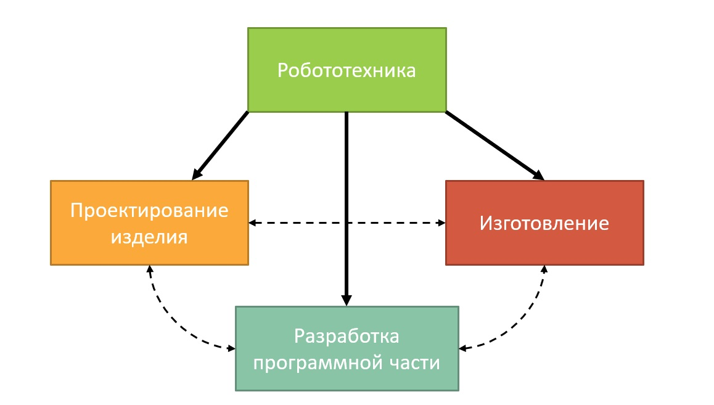
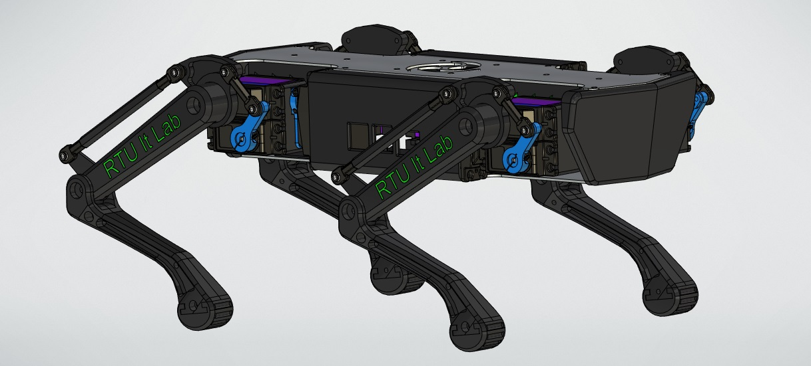
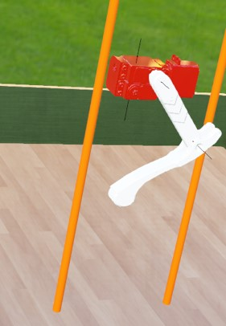
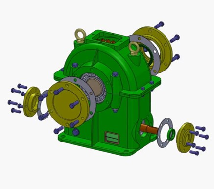

# Требования по направлению `Робототехника`

### Предисловие
По данному направлению в этом году предлагается выбрать одно из трёх заданий:
- [Задание на проектирование](#задание-на-проектирование)
- [Задание на разработку программной части](#задание-на-разработку-программной-части)
- [Задание на сборочную документацию](#задание-на-сборочную-документацию)

Выбирая определённое задание, в дальнейшем, вы не ограничиваете себя определённой областью деятельности, 
поэтому смело можете браться за задание, в успешном выполнении которого вы больше уверены.
Задания сделаны с запасом сложности, поэтому не переживайте раньше времени, если задание не получилось выполнить на 100%.
Наша задача уже будет отобрать людей сугубо по тому, что вы успели сделать

Все задания учитывают основные области деятельности лаборатории в области робототехники

## Задание на проектирование

Проектирование - начальный этап разработки робототехнической системы, 
который следует преодолеть команде после получения задания или появлении идеи.
Именно на этом этапе закладываются дальнейшие функции робота.
Но чтобы не грузить вас написанием проектной документации предлагаем более практик ориентированное задание,
направленное на выявление следующих компетенций:
- Умение работать в CAD программах, с целью создания чертежей отдельных деталей и сборок
- Знание базовых электрических узлов и их характеристик в мобильных роботах
- Умение подбирать оптимальные сторонние элементы робототехнической системы (сенсоры, движители)

### Цель
Спроектировать мобильного робота, ориентированного на исполнение прикладных задач. 
Разработка физического прототипа является **необязательной** частью

### Описание
В этом году предлагается выполнить типовое решение или придумать идею для собственного робота.
Оцениваться задания также будут по-разному, учитывая особенности более творческого, но и фривольного второго варианта

> В нашей лаборатории многие проекты спроектированы на TFlex CAD 17, поэтому рекомендуется проектировать в нём

#### Типовое решение (робот-пылесос)
Предложенным заданием является проектирование собственного прототипа робота-пылесоса, которого возможно напечатать на 3D-принтере.
Его конструкция не требует большого количества времени, но позволяет продемонстрировать нужные компетенции.

Что мы ждём от вас, как результат:
- Чертежи печатных элементов
- Сборка конструкции в CAD (всех печатных и сторонних элементов)
- Принципиальную электрическую схему робота
- Небольшую презентацию по потенциальному функционалу

Ограничения:
- Использование отечественных CAD
- Конструкция должна быть ремонтнопригодной, а значит лучше отказаться от печатной резьбы и использовать гайки
- Подбор сторонних компонентов (двигателей, контроллеров и прочего) следует выполнять с учётом их доступности в российских магазинах и маркетплейсах

#### Собственный робот
В данном подварианте задания мы предлагаем проявить немного фантазии и спроектировать
*мобильного* робота под прикладную задачу. Вариант подойдёт для людей, у которых есть давно идея, но
руки не доходили. Робот также предполагается в исполнении из пластика на 3D-принтере, что следует учитывать.

Если ваша идея окажется достаточно интересной, то после прохождения отбора ты сможешь продолжить реализовывать идею в "металле"!
Кроме вышеуказанных компетенций мы ожидаем от вас креативного подхода, что естественно будет давать бонусы при наборе.

Всё также мы ждём в форме результата:
- Чертежи печатных элементов
- Сборка конструкции в CAD (всех печатных и сторонних элементов)
- Принципиальную электрическую схему робота
- Небольшую презентацию по идеи робота в целом

Ограничения:
- Использование отечественных CAD
- Конструкция должна быть ремонтнопригодной, а значит лучше отказаться от печатной резьбы и использовать гайки
- Подбор сторонних компонентов (двигателей, контроллеров и прочего) следует выполнять с учётом их доступности в российских магазинах и маркетплейсах

### Критерии

* Оригинальность идеи

  Данный критерий в первую очередь направлен на людей, создающих своего робота,
  но сюда же будут идти баллы за уникальные решения в роботе-пылесосе.
  
* Читаемость и чистота чертежей

  Следует учитывать, что работают инженеры в командах, а значит следует уважать время ваших коллег.
  Чертежи и электрическая схема должны быть читаемыми может быть не для человека со стороны,
  но хотя бы для профильного специалиста.
  
* Унификация сторонних элементов

  Обилие различных крепежей, двигателей, сенсорики - усложняет сборку, покупку, поддержание вашего робота.
  Следует использовать актуальные и массовые элементы, доступность которых не под вопросом.
  Если где-то можно задействовать ранее использованный в сборке винт, гайку, шайбу - используйте!
  
* Реализуемость

  Данный критерий отражает то, насколько на уровне текущего развития технологий существует возможность создания физического прототипа.

* Расходование ресурсов

  Не следует особо заигрываться с обилием датчиков, дорогими двигателями или микрокомпьютерами. Всё должно быть в пределах DIY проекта.
  
### Формат публикации результатов
Потребуется прикрепить ссылку на облачное хранилище со сборкой, инструкцией в формате Markdown (чтобы знать какие файлы смотреть и чем открывать) и прочими материалами проекта.

## Задание на разработку программной части
Данное задание призвано найти студентов, способных работать с симуляцией робототехнической системы.
Этап виртуального моделирования уже спроектированного робота сложно переоценить в современной робототехнике так,
как позволяет отследить ошибки, допущенные при проектировании или при разработке программного кода, до испытаний на прототипе,
что в итоге снижает риски.
Компетенции, которые мы ожидаем увидеть по данному заданию:
- Умение строить математическую модель узлов робототехнической системы
- Работать с симуляцией и программировать виртуальную среду
- Грамонтно создавать программные модули для отдельных узлов системы

### Цель
Смоделировать работу механического узла робота в симуляторе

### Описание
Вам предлагается взять спроектированную ногу робота квадрупеда и для неё разработать в виртуальной среде демонстрационный стенд и программный модуль.
Демонстрационным тестом должна являться площадка с вертикальными линейными направляющими, позволяющая ноге свободно поднимать вверх и вниз.
В задачи программного модуля должно входить: 
решение [задачи обратной кинематики](https://en.wikipedia.org/wiki/Inverse_kinematics) ноги, контролировать нагрузку в точках крепления, выполнять динамически сформулированные движения.
Для возможности динамического контроля нагрузки и положения разрешается использовать PID-регулируемые двигатели (с обратной связью),
а на конце ноги установить датчик давления.

Что мы ждём от вас, как результат:
- Решение задачи обратной кинематики для полученной модели ноги
- Проект виртуальной среды, где робонога выполняет прыжки с определённой нагрузкой в точках крепления
- Видео ролик с демонстрацией работы (на случай, если не получится запустить проект)

Ограничения:
- Язык программирования: C++ или Python
- Максимальный крутящий момент торможения двигателя до 70 кг*см
- Все 2 двигателя в робоноге имеют одинаковые характеристики для унификации

> Мы не ограничиваем вас в выборе среды симуляции, но рекомендуем использовать:
[Gazebo](http://gazebosim.org/), [Webots](https://cyberbotics.com/), [PyBullet](https://pybullet.org/).

### Критерии

* Решение задачи обратной кинематики

  Создать демонстрационный стенд и записать ролик можно было бы и без решения задачи обратной кинематики,
  но именно знание некоторых разделов математики и применение их на практике мы ожидаем от вас
  
* Работа с сенсорикой
  
  Программный модуль должен не только задавать нужное движение ноги, но и сообщать вышестоящим модулям о положении ноги, нагрузке и другую информацию.
  Чем лучше это будет организованно сразу, тем более комплексное представление будет иметь о себе робот
  
* Чистота кода программного модуля

  Простое и понятное условие к любому коду в современных реалиях коллективной разработки
  
* Экономия вычислительны ресурсов

  Симуляция не должна быть перегружена и в идеале должна рассчитываться в real-time на среднем железе,
  поэтому можете пойти на оптимизацию геометрии элементов ноги, если посчитаете нужным. Главное сохранить пропорции рычагов
  
### Формат публикации результатов
Требуется прикрепить ссылку на репозиторий GitHub с разработанной виртуальной средой и документацией. Видеоролик приложить в облако, а ссылку на него в документации в репозитории

### Материалы
Ссылка на архив с элементами ноги робота (в формате полигональной графики .obj): https://disk.yandex.ru/d/7YWnuxXpysc3Qg

## Задание на сборочную документацию

Последним этапом перед первыми "шагами" вашего робота становится собственно его изготовление,
которое сопряжено с рядом моментов. Когда сборкой робота занимается сам же его проектировщик,
проблем возникает намного меньше, чем когда данный этап выполняет другой человек, что на реальном
производстве зачастую именно так. Из этого следует, что для этапа изготовления тажке нужно подготовить некую инструкцию

Компетенции, которые затрагивает данное задание:
- Составление сборочной документации
- Работа в подмодулях CAD для создания сборочной анимации
- Реинжиниринг сборки/разборки

### Цель
Требуется подготовить интерактивную и дружелюбную сборочную документацию к приложенному проекту

### Описание
Формат вашего решения данного задания может являться достаточно креативным и выполнен на различном ПО.
Основную сложность представляет собой проведение реинжиниринга сборки робота, так как вы не обладаете
точной информации по сборке. Такая ситуация очень часто может произойти в случае ремонта покупного оборудования,
в том числе робота, поэтому данный навык очень пригодится в дальнейшей работе.

Состоять решение должно из:
- Анимации сборки и разборки в специализированном ПО (многие CAD системы позволяют создавать анимации сборки внутри)
- Составить статическую таблицу компонентов сборки (всё что нужно напечатать/купить и кол-во)
- *Опционально:* запрограммировать динамическую таблицу элементов сборки, которая будет учитывать изменение в сборке (добавление новых винтов, смена гаек и так далее)
- Оформить инструкцию, в котором будут отображены анимации этапов сборки и прикреплена таблица (если таблица динамическая - описать её использование)

Добавим про динамическую таблицу: зачастую её легче всего сделать силами CAD программы, где открывается сборка. Будь это макрос или встроенный модуль.
Для этого вы можете, как угодно, менять сборку, даже переносить её в другой САПР. Главное - добиться результата, чтобы не допускать ошибки (со стороны человека) при закупке компонентов для сборки.

Ограничения:
- Отечественные решения для создания анимации
- Таблица читаемая офисными инструментами (Microsoft Excel, МойОфис Таблица)
- Инструкцию нужно оформить в формате Markdown

### Критерии

* Дружелюбность документации к стороннему читателю

  Созданная вами инструкция будет понятно даже школьнику, который сможет собрать робота самостоятельно из готовых деталей

* Эстетическое оформление текстовой части
  
  Markdown позволяет красиво оформить документацию, а значит и повысить её привлекательность

* Полнота описания требуемых для сборки компонентов
  
  Описаны все элементы в таблице, требуемые для сборки собаки
  
* Анимация сборки и разборки

  Её наличие, проработанность каждого момента по сборке
  
### Формат публикации результатов
Требуется приложить ссылку на облачное хранилище с результатами выполненного задания
  
### Материалы
Ссылка на сборку: https://disk.yandex.ru/d/NQLir-0ETRsXtQ
